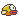
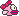
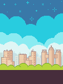
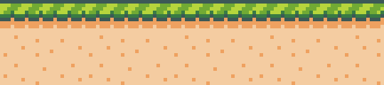
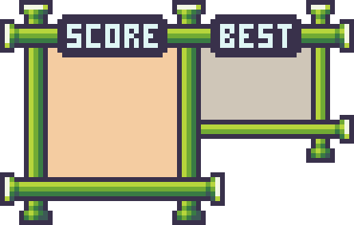

# Flappy Bird 

## Giới thiệu chung

**Tên game**: Flappy Bird  
**Họ và tên**: Hoàng Quốc Tuấn 
**MSSV**: 21021549  
**Lớp học phần**: 2324H_INT2215_70

## Lời nói đầu

Flappy Bird là một trò chơi điện tử đơn giản nhưng vô cùng gây nghiện, được phát triển bởi Nguyễn Hà Đông. Người chơi điều khiển một chú chim bay qua các khe hẹp giữa những chiếc ống, với mỗi lần nhấn, chú chim sẽ bay lên một chút và trọng lực sẽ kéo chú chim xuống. Mục tiêu của trò chơi là đạt được số điểm cao nhất có thể bằng cách vượt qua nhiều ống nhất mà không va chạm vào chúng. Mặc dù gameplay cực kỳ đơn giản, Flappy Bird đã trở thành một hiện tượng toàn cầu nhờ độ khó đầy thử thách và khả năng khiến người chơi luôn muốn thử lại mỗi khi thất bại.

## Demo Video

Xem video demo tại (https://drive.google.com/file/d/1B4rjzXS3bSLYNYB-aNMpaAvSWcaTJb4L/view?usp=sharing).

## Cách cài đặt game

### Bước 1: Cài đặt môi trường: Có thể cài đặt môi trường là Visual Studio Code phiên bản mới nhất và cài đặt những thiết lập cần thiết(C/C++ 17). 
Link: https://code.visualstudio.com/download
### Bước 2: Cài đặt các thư viện cần thiết bao gồm SDL2.framework, SDL2_image.framework, SDL2_mixer.framework, SDL2_ttf.framework.
Link: https://github.com/libsdl-org/SDL/releases/tag/release-2.30.6
### Bước 3: Tải game và chạy:
   - **Clone repo bằng terminal**:
     - Truy cập trang GitHub của dự án: (https://github.com/quoctuan061103/Flappy-Bird.git).
     - Mở terminal và chạy lệnh sau để clone repo về máy:
       ```bash
       git clone https://github.com/quoctuan061103/Flappy-Bird.git
       ```
   - **Tải về dưới dạng file `.zip`**:
     - Truy cập trang GitHub của dự án: (https://github.com/quoctuan061103/Flappy-Bird.git).
     - Chọn nút `Code` -> `Download Zip` và giải nén.

## Cách chơi game

1. **Khởi động trò chơi**:
   - Ở màn hình lúc vừa khởi động, nhấn `PLAY` để bắt đầu chơi

2. **Điều khiển**:
   - Mỗi lần nhấn phím `SPACE` chú chim sẽ bay lên một đoạn ngắn.
   - Nếu không nhấn, chú chim sẽ rơi xuống do trọng lực.

3. **Mục tiêu**:
   - Điều khiển chú chim bay qua các khoảng trống giữa các cột ống và tránh va chạm với chúng.
   - Mỗi cột ống vượt qua thành công sẽ mang về 1 điểm.

4. **Trò chơi kết thúc**:
   - Trò chơi kết thúc nếu chú chim va chạm vào cột ống hoặc rơi xuống đất.
   - Sau khi trò chơi kết thúc, số điểm đạt được và số điểm cao nhất đã từng chơi sẽ được hiển thị.
   - Người chơi có thể chơi lại để cải thiện số điểm.

5. **Tính năng thêm**:
   - Có thể tùy chọn skin cho chú chim của mình

## Các thành phần trong game

- **Nhân vật chính**:
  - Flappy Bird  
    
  - Skin  
    
- **Vật cản**:
  - Ống nước trên  
    
  - Ống nước dưới  
    
- **Background**:
  - Nền  
     
  - Mặt đất  
      
- **Bảng điểm**:
     
- **Cách thức điều khiển**: Sử dụng phím `SPACE`
- **Âm thanh**: Âm thanh mô phỏng các hành động của chú chim.
- **Chức năng khác**: Chơi lại, đổi nhân vật, lưu điểm cao, v.v.

## Một số hình ảnh trong game
          

## Các nguồn tham khảo 

* [Lazy Foo's Productions](https://lazyfoo.net/tutorials/SDL/index.php) for SDL2 tutorial
* [Askari Hassan](https://www.youtube.com/@askarihassan2632) for "How to make Flappy Bird" tutorial 
* [Duc Le](https://github.com/DuCLeK65t) for public Flappy Bird-like's assets

## Các kỹ thuật được sử dụng

- Thư viện **SDL2** (hình ảnh, âm thanh, font chữ).
- Xử lý thời gian thực, thao tác chuột, âm thanh, hình ảnh và bàn phím.
- Lưu và ghi điểm cao qua file.
- Tính toán vật lý để mô phỏng độ rơi và góc nghiêng của con chim.
- Áp dụng kế thừa và đa hình trong lập trình hướng đối tượng.
- Quản lý nhiều đối tượng như con chim, background, menu, v.v.

### Những cải thiện mong muốn cho các phiên bản kế tiếp

- Thêm chế độ chơi dễ hoặc khó
- Kết nối với các nền tảng như Facebook hay X để chia sẻ với mọi người
- Có thêm đa dạng và nhiều mẫu skin hơn
- Chế độ kết nối mạng để có thể thi đấu với nhau

